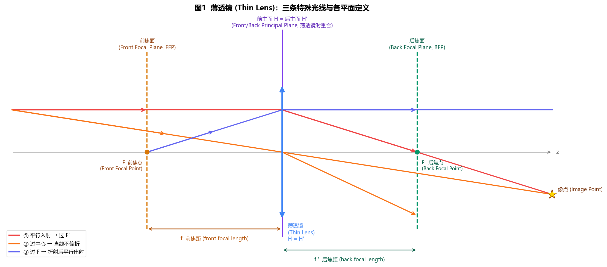
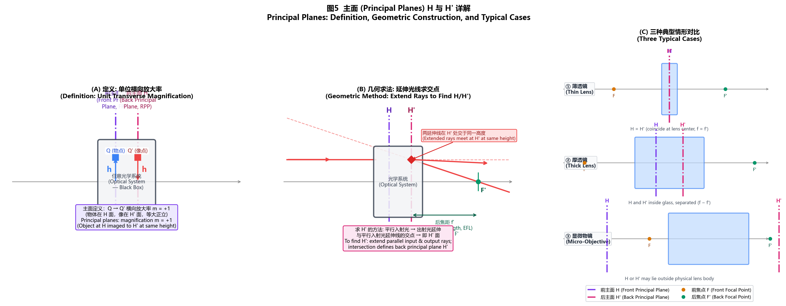
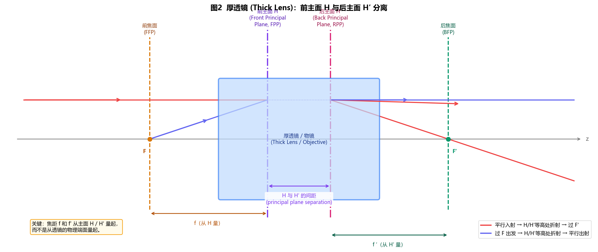
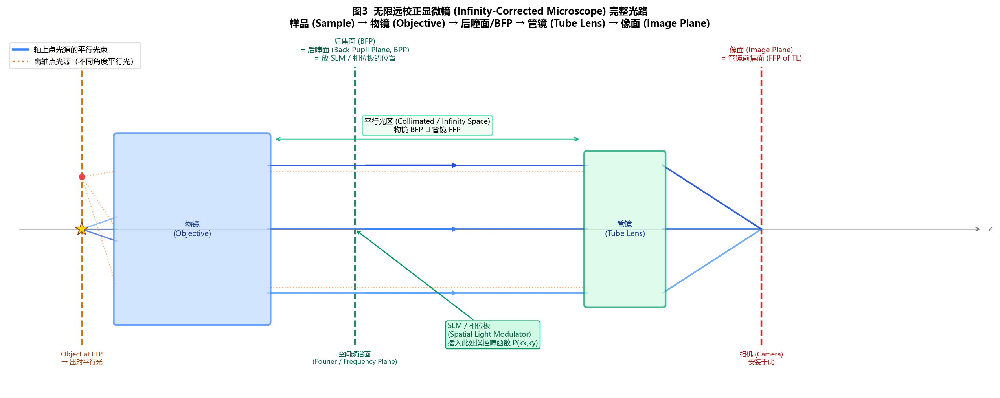
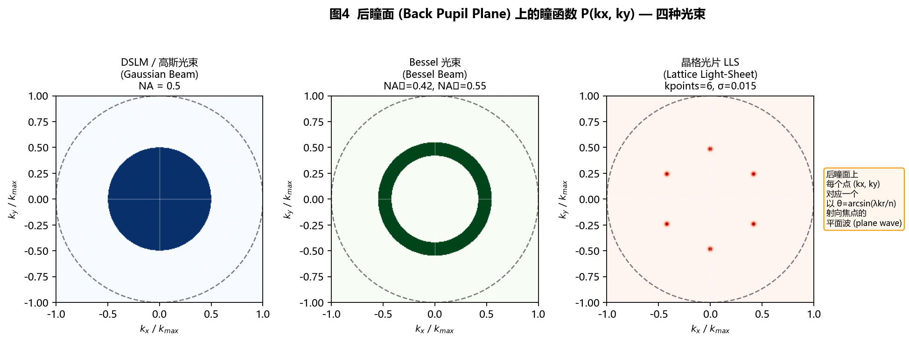
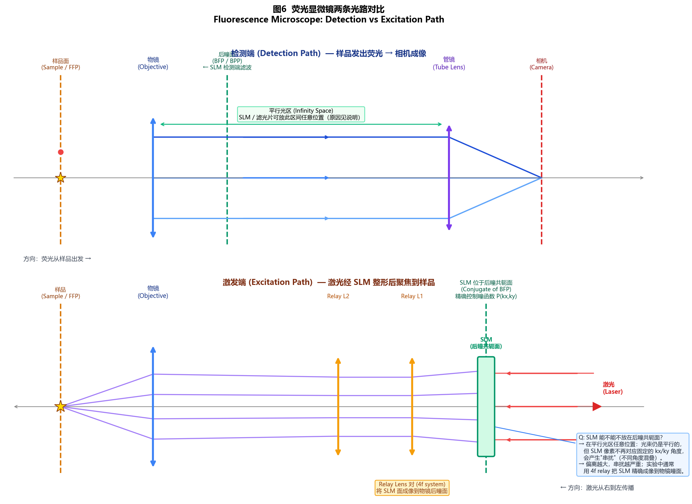

# PSF 模拟方法说明

> 本文档说明仿真中点扩散函数（PSF）的计算方法，适用于论文的方法章节。
> 代码实现见 `biobeam/` 目录及 `interactive_pupil_psf.ipynb`。

---

## 一、理论基础：矢量德拜衍射积分（Richards-Wolf 理论）

> **人话版**：光通过高 NA 物镜聚焦时，不能只用简单的几何光学来算焦点的样子（几何光学只告诉你光线往哪走，不告诉你亮度分布）。Richards-Wolf 理论把物镜后瞳面上的每一块小区域都看作一束平面波，所有平面波到达焦点时会互相叠加（干涉），叠加的结果就是 PSF 的形状。NA 越大，参与叠加的平面波角度范围越广，PSF 就越小（分辨率越高）。这套理论在高 NA（> 0.6）时是必须用的，低 NA 时可以用更简单的傅里叶方法近似。

所有激发端 PSF 的计算均基于**矢量德拜衍射理论**（Vectorial Debye Diffraction Theory），由 Richards & Wolf（1959）提出，后经 Foreman & Toeroek（2011）系统梳理。

该理论将高数值孔径（NA）物镜焦场表示为在球面波矢空间（Ewald sphere）上的相干叠加（coherent superposition）积分。对于输入偏振态 $(E_{x0}, E_{y0})$，焦场三个分量为：

$$E_x = E_{x0}(I_0 + I_2\cos 2\varphi) + E_{y0}\sin 2\varphi \cdot I_2$$

$$E_y = E_{y0}(I_0 - I_2\cos 2\varphi) + E_{x0}\sin 2\varphi \cdot I_2$$

$$E_z = -2i\, I_1\,(E_{x0}\cos\varphi + E_{y0}\sin\varphi)$$

其中三个德拜积分定义为：

$$I_n(k_r, k_z) = \int_{\alpha_1}^{\alpha_2} A(\theta)\,\sqrt{\cos\theta}\,\sin\theta\cdot f_n(\theta)\cdot J_n(k_r\sin\theta)\cdot e^{ik_z\cos\theta}\,d\theta$$

- $\theta$：半孔径角（half-aperture angle），$\alpha_1 = \arcsin(NA_1/n_0)$，$\alpha_2 = \arcsin(NA_2/n_0)$
- $k_r = 2\pi/\lambda \cdot \sqrt{x^2+y^2}$，$k_z = 2\pi z/\lambda$（均在介质中）
- $\varphi = \arctan(y/x)$：方位角（azimuthal angle）
- $f_0(\theta) = 1+\cos\theta$，$f_1(\theta) = \sin\theta$，$f_2(\theta) = 1-\cos\theta$
- $J_n$：第一类 $n$ 阶 Bessel 函数
- $A(\theta)$：瞳面幅值函数（pupil amplitude function），由光束类型决定
- 强度 $\text{PSF} = |E_x|^2 + |E_y|^2 + |E_z|^2$

权重因子 $\sqrt{\cos\theta}\,\sin\theta$ 来自 Abbe 正弦条件（能量守恒）。

**数值实现**：BioBeam 在 GPU（OpenCL）上用梯形规则对上述积分离散化（默认 100 步），核函数分别为 `psf_debye.cl`、`psf_lattice.cl`、`psf_cylindrical.cl`。

---

### 四种显微镜模式的 Richards-Wolf 理论应用对比

> **人话版**：同样是 Richards-Wolf 积分，四种显微镜喂进去的"瞳函数图案"完全不一样，激发端和检测端的逻辑也不一样。下表把四种模式并排对比，方便理解各自的设计思路。

#### 激发端对比

| | Widefield | Confocal | SPIM（柱面透镜光片） | LLSM（晶格光片） |
|---|---|---|---|---|
| **照明方式** | 宽场泛光照明（flood illumination）；不聚焦 | 单点聚焦激光扫描 | 柱面透镜形成线焦点光片 | SLM 产生多束 Bessel 干涉光片 |
| **瞳函数 $A(\theta,\phi)$** | 全场均匀平面波，不经物镜聚焦；无需积分 | 圆形均匀孔径 $\mathbf{1}[k_r \le NA]$，标准 Airy 焦斑 | 条形孔径（line aperture）；仅 $k_y$ 方向聚焦，$k_x$ 方向自由传播 | 离散 $N$ 点（$N=6$ 六边形）位于环形 $[NA_1, NA_2]$ 上，每点高斯展宽 $\sigma$ |
| **积分维度** | 不适用（无焦点） | 二维球面积分（$\theta, \phi$） | 一维积分（仅 $\theta$ 方向，Sheppard 标量模型） | 每个 k 点做一维 $k_y$ 积分，再对 $N$ 点求和 |
| **Richards-Wolf 核函数** | 不适用 | `psf_debye.cl`（标准矢量三积分 $I_0, I_1, I_2$） | `psf_cylindrical.cl`（标量柱面积分） | `psf_lattice.cl`（矢量积分 + 高斯权重 + 环形截断） |
| **典型激发 NA** | 低（$\sim$0.1，或条件光）| 与检测共用同一物镜（$\sim$0.7–1.4） | 低（$\sim$0.1–0.3，仅一维） | 环形（$NA_1=0.42, NA_2=0.55$） |
| **激发 PSF 形状** | 无（均匀照明） | 三维衍射极限 Airy 点，焦深短 | 光片（y 方向高斯，x 方向无限延伸） | 光片（薄、旁瓣低；六束 Bessel 相干叠加） |
| **轴向选择性** | 无（整个样品体都被照明） | 由检测端针孔（pinhole）决定，激发本身无轴向截面 | 由光片厚度决定（$w_0 \approx 0.51\lambda/NA$） | 由环形 NA 宽度和 $\sigma$ 共同决定（优于 SPIM） |

#### 检测端对比

| | Widefield | Confocal | SPIM | LLSM |
|---|---|---|---|---|
| **检测物镜孔径** | 圆形均匀孔径，高 NA | 圆形均匀孔径，与激发共用同一物镜 | 圆形均匀孔径，与激发**正交方向**放置 | 圆形均匀孔径，与激发正交（高 NA，$\sim$0.9） |
| **Richards-Wolf 积分** | 标准矢量三积分，圆孔 $\mathbf{1}[k_r \le NA_{det}]$，结果为 Airy PSF | 同 Widefield，但需乘以针孔传递函数 | 同 Widefield | 同 Widefield |
| **是否有轴向截面（光学切片）** | 无；所有 z 深度荧光同时叠加在相机上 | 有；针孔拒绝焦外光，轴向分辨率 $\sim \lambda/NA^2$ | 有；光片本身限制了被激发的 z 范围 | 有；光片更薄，轴向分辨率优于 SPIM |
| **有效 PSF** | $\text{PSF}_\text{det}(x,y,z)$（无轴向限制，z 方向扩散） | $\text{PSF}_\text{exc} \times \text{PSF}_\text{det}$，两端 NA 相同，分辨率提升 $\sim\sqrt{2}$ | $\text{PSF}_\text{exc,sheet}(y,z) \times \text{PSF}_\text{det}(x,y,z)$ | $\text{PSF}_\text{exc,LLS}(y,z) \times \text{PSF}_\text{det}(x,y,z)$ |
| **检测端对矢量效应的敏感度** | 高 NA 检测时明显（$E_z$ 分量影响焦斑形状） | 高 NA 时同上；线偏振激光焦斑非圆对称 | 相对低 NA 时影响较小 | 高 NA 检测（0.9）时需矢量处理 |
| **BioBeam 实现** | `psf_debye.cl`（圆孔参数） | 未直接实现 | `psf_cylindrical.cl`（激发）+ `psf_debye.cl`（检测） | `psf_lattice.cl`（激发）+ `psf_debye.cl`（检测） |

#### 一句话总结各模式的设计取舍

| 模式 | 核心取舍 |
|------|---------|
| **Widefield** | 速度最快（全场一次曝光），但无轴向光学切片能力，深层样品背景噪声高 |
| **Confocal** | 两端共用高 NA 物镜，分辨率最高，但针孔使信号损失大，速度慢 |
| **SPIM** | 激发和检测正交分离，天然光学切片，光毒性低；光片越薄则焦深越短 |
| **LLSM** | 在 SPIM 基础上，用晶格干涉同时实现薄光片和低旁瓣，是目前最优的活细胞 3D 成像方案 |

---

### 本项目各 PSF 的实际模拟方式

> **人话版**：上面是理论对比，这里说清楚本项目里每种 PSF 实际用了哪个库、哪个模型、基于什么理论。Widefield 和 Confocal 用的是 `widefield-confocal-psf`（Gohlke），SPIM 和 LLSM 用的是 BioBeam。

| PSF 类型 | 使用的库 | 调用方式 | 底层理论 | 积分方式 | 是否含偏振 | 是否含像差 |
|---|---|---|---|---|---|---|
| **Widefield** | `widefield-confocal-psf` （Gohlke, cgohlke/psf） | `PSF(ISOTROPIC \| WIDEFIELD, ...)` | Richards-Wolf（1959）**标量等向性**模型；有效 PSF = 激发 PSF × 发射 PSF | (z, r) 柱坐标下对 θ 做一维数值积分（C 扩展，80 步），利用旋转对称展开为 3D | 否（标量，不考虑偏振旋转） | 否（理想无像差） |
| **Confocal** | `widefield-confocal-psf` （Gohlke, cgohlke/psf） | `PSF(ISOTROPIC \| CONFOCAL, pinhole_radius=..., ...)` | Richards-Wolf 标量等向性；有效 PSF = 激发 PSF × 发射 PSF ⊗ 针孔卷积核 | 同上；针孔以圆形或方形卷积核加权（`pinhole_kernel()`） | 否 | 否 |
| **SPIM（柱面透镜光片）** | `BioBeam` （Weigert et al., 2018） | `psf_cylindrical.cl`（激发） `psf_debye.cl`（检测） | 激发：Sheppard（2013）**标量柱面积分**；检测：Richards-Wolf **矢量**德拜积分 | 激发：一维 θ 积分（`INT_STEPS=100`）；检测：二维矢量三积分（$I_0,I_1,I_2$），OpenCL GPU | 检测端是（$E_x,E_y,E_z$）；激发端否 | 否 |
| **LLSM（晶格光片）** | `BioBeam` （Weigert et al., 2018） | `psf_lattice.cl`（激发） `psf_debye.cl`（检测） | 激发：Richards-Wolf **矢量**德拜积分，N 个 k 点各做高斯加权一维积分；检测：同上 | 激发：对每个 k 点做 $k_y$ 方向一维积分 × N 点求和；检测：二维矢量积分，OpenCL GPU | 是（激发和检测均含偏振） | 否 |

**两个库的核心区别**：

| | `widefield-confocal-psf` | `BioBeam` |
|---|---|---|
| **坐标系** | 柱坐标 (z, r)，利用旋转对称性，只算 1/4 截面 | 三维笛卡尔坐标 (x, y, z)，全 3D 体积 |
| **偏振处理** | 标量（等向性，无偏振旋转） | 矢量（完整 $E_x, E_y, E_z$ 三分量） |
| **速度** | CPU，毫秒级（利用对称性） | GPU（OpenCL），适合大体积高精度计算 |
| **光束类型** | 仅 Widefield / Confocal / Two-photon | Widefield、Bessel、柱面 SPIM、晶格 LLS |
| **像差支持** | 无（理想模型）；可选 Gaussian 近似 | 无（理想模型）；像差需用附录 Gibson-Lanni 模型 |
| **参考文献** | Richards & Wolf (1959); Zhang et al. (2007) for Gaussian | Foreman & Toeroek (2011); Sheppard (2013); Chen et al. (2014) |

---

## 二、角谱传播方法（交互式 Notebook 中使用）

> **人话版**：Notebook 里用的是一个更简单的算法。你在瞳面上画一个图案（比如一个圆环），程序做一次傅里叶变换，就直接得到焦点处的光场。再往 z 方向每走一步，就乘以一个相位因子，相当于让光继续传播。整个过程不需要 GPU，速度很快，适合交互式地调参、看效果。代价是：它忽略了偏振，高 NA 时会有一点误差。

在 `interactive_pupil_psf.ipynb` 中，激发端的 3D 传播用**标量角谱法**（Angular Spectrum Method）模拟：

$$E(x, z) = \mathcal{F}^{-1}\!\left\{ P(k_x, k_y)\cdot e^{i 2\pi k_z z} \right\}, \quad k_z = \sqrt{1 - k_x^2 - k_y^2}$$

- $P(k_x, k_y)$：归一化坐标下的瞳函数（Pupil Function，$k_r = 1$ 对应最大 NA）
- $k_z$ 取实部（倏逝波（evanescent wave）区域令 $k_z = 0$）
- $\mathcal{F}^{-1}$：二维逆傅里叶变换

焦面 PSF 为 $|\mathcal{F}\{P\}|^2$，xz 截面通过对每个 z 切片依次传播计算。

此方法与 Debye 积分在标量近似下等价，无需 GPU，适合交互式参数探索。

---

## 三、检测端 PSF

> **人话版**：检测端就是"收集荧光"那一侧的物镜。荧光从样品里往四面八方发出，物镜能收集的角度范围由 NA 决定。NA 越大、收集角越宽，PSF 就越小、分辨率越高。理想情况下（没有像差），检测端的焦点形状是一个"Airy 图案"（中间亮盘 + 外圈若干暗环亮环），这是圆形孔径衍射的标准结果。本仿真假设物镜是完美无像差的。

检测端使用**均匀圆形孔径**、水浸物镜：

$$P_\text{det}(k_r) = \begin{cases} 1 & k_r \leq \sin\alpha_\text{det} \\ 0 & \text{其他} \end{cases}$$

代入矢量 Debye 积分后，理想焦面强度为 **Airy 图案**：

$$\text{PSF}_\text{det}(r) \propto \left[\frac{2J_1(k\,\text{NA}\cdot r/n_0)}{k\,\text{NA}\cdot r/n_0}\right]^2$$

**仿真所用参数**：
- 检测 NA = 0.9（水浸，$n_0 = 1.33$）
- 视场 FOV ≈ 5.2 μm
- 模型为理想无像差 PSF

> BioBeam 检测端不包含球差、折射率失配等像差。若需纳入像差，可使用 Gibson-Lanni 模型（见附录）。

---

## 四、激发端 PSF

> **人话版**：激发端是"打光"那一侧，决定了哪里被照亮、光片有多薄。不同的光束类型本质上是在后瞳面上放了不同形状的"光路图案"（瞳函数），透镜做傅里叶变换后，焦点的形状就不一样。下面四种光束从简单到复杂依次介绍。

### 4.1 DSLM / 高斯光束

> **人话版**：最普通的聚焦激光束。瞳面整个圆都亮，焦点是一个经典的衍射极限小点（Airy 盘）。NA 越大，横向越细，但同时焦深也越短。实际用的时候需要快速左右扫描才能形成一张"光片"。

**圆形均匀瞳面**，对应聚焦高斯光束：

$$P_\text{DSLM}(k_r) = \mathbf{1}[k_r \leq NA]$$

- 焦面为衍射极限 Airy 图案，z 方向为高斯包络
- 焦深（depth of field, DOF）$\approx \lambda n_0 / NA^2$，与 NA 平方成反比
- 实际成像时需沿 x 方向快速扫描，形成等效光片

**特点**：分辨率最高，但 NA 越大焦深越短，对大视场不利。

---

### 4.2 Bessel 光束

> **人话版**：把瞳面中间挡住，只留一个细环通过。这样焦点变成了"无衍射 Bessel 光束"——中间有一个很细的亮线，外面围着一圈圈越来越弱的"旁瓣"（副环）。它的优点是焦深很长，光束不会像高斯光束那样传播一段就扩散开；缺点是旁瓣会把不该被激发的荧光也打亮，需要后处理去除。

**环形孔径**（Annular Aperture），环内均匀透射：

$$P_\text{Bessel}(k_r) = \mathbf{1}[NA_1 \leq k_r \leq NA_2]$$

焦场为无衍射（non-diffracting）Bessel 光束，轴线强度分布为：

$$I(r) \propto J_0^2\!\left(\frac{2\pi}{\lambda}\, r\,\sin\theta_0\right), \quad \theta_0 = \arcsin\!\frac{NA_1+NA_2}{2n_0}$$

- 环越窄（$NA_2 - NA_1 \to 0$）→ 传播无衍射距离越长，但旁瓣越强
- 旁瓣会带来轴外背景荧光，需后处理去除

---

### 4.3 柱面透镜 SPIM（直接光片）

> **人话版**：用一个"柱面透镜"（就像一段圆柱面切下来的透镜）代替普通圆透镜。它只在一个方向聚焦，另一个方向不聚焦，所以焦点不是一个点，而是一条线——也就是直接形成了一张光片，不需要高斯光束那样左右扫描。缺点是光片比较厚，轴向分辨率较差。

**柱面透镜**仅在 y 方向聚焦，x 方向为线焦点，直接形成光片，无需扫描。BioBeam 基于 Sheppard（2013）的标量积分（`psf_cylindrical.cl`）：

$$E(y, z) = \int_{-\alpha}^{\alpha} \sqrt{\cos t}\;\exp\!\left[i\!\left(\frac{2\pi y}{\lambda}\sin t + \frac{2\pi z}{\lambda}\cos t\right)\right] dt$$

对应瞳函数为**条形掩模**（line aperture），仅在 $k_y$ 方向有限宽：

$$P_\text{cyl}(k_x, k_y) = \mathbf{1}[|k_y| < \Delta k_y]\cdot\mathbf{1}[k_r \leq NA]$$

- 光片厚度（y 方向）$w_0 \approx 0.51\lambda / NA$
- x 方向无衍射，光片在整个视场内均匀，但厚度大于等 NA 的高斯光束

---

### 4.4 晶格光片（Lattice Light-Sheet，LLS）

> **人话版**：晶格光片是 Bessel 光束的升级版。前面说 Bessel 光束的旁瓣问题很烦——那么，如果我在瞳面环上均匀放 6 个点（六边形顶点位置），6 束 Bessel 光束会同时到达焦区并干涉。干涉的结果是：旁瓣互相"抵消"，只留下中心的细亮线，光片变薄了，旁瓣也大幅降低。这就是晶格光片——本质上是多束 Bessel 光束的相干叠加，通过 SLM 在瞳面上打出特定图案来实现。

**晶格光片**由 Chen et al.（2014）提出，通过在环形瞳面上放置多个离散 k 点，多束 Bessel 光束干涉形成晶格图案，在保持较长焦深的同时大幅抑制旁瓣。

#### 瞳面设计

瞳面由 $N$ 个等角分布的多边形顶点构成，位于环形中心半径处：

$$\mathbf{k}_i = \arcsin\!\frac{NA_1+NA_2}{2n_0}\begin{pmatrix}\cos\varphi_i \\ \sin\varphi_i\end{pmatrix},\quad \varphi_i = \frac{\pi}{2} + \frac{2\pi i}{N},\quad i = 0,\ldots,N-1$$

每个 k 点在 $k_y$ 方向以高斯函数 $\sigma$ 展宽，乘以环形掩模（$NA_1 \leq k_r \leq NA_2$）截断：

$$P_\text{LLS}(k_x, k_y) = \mathbf{1}[NA_1 \leq k_r \leq NA_2] \cdot \sum_{i=1}^{N} \frac{1}{\sigma}\exp\!\left[-\frac{(k_y - k_{y,i})^2}{2\sigma^2}\right]$$

#### BioBeam 矢量实现（`psf_lattice.cl`）

在矢量德拜框架下，对每个 k 点做 $k_y$ 方向的 1D 积分：

$$E(\mathbf{r}) = \sum_{i=1}^{N} \int_{k_{y,i}-4\sigma}^{k_{y,i}+4\sigma} \frac{1}{\sigma}\, e^{-(k_y-k_{y,i})^2/2\sigma^2}\cdot \mathcal{K}(k_{x,i},\, k_y,\, \mathbf{r})\,dk_y$$

其中 $\mathcal{K}$ 为矢量衍射核（vectorial diffraction kernel，含 $\sqrt{\cos\theta}\sin\theta$ Abbe 权重和平面波相位因子 $e^{i\mathbf{k}\cdot\mathbf{r}}$），并在径向方向加入环形掩模截断。

#### 参数说明

| 参数 | 物理含义 | 效果 |
|------|---------|------|
| `NA1`, `NA2` | 环形掩模内外 NA | 决定 k 点半径；$NA_2-NA_1$ 越小，无衍射范围越长 |
| `kpoints`（N） | 多边形顶点数 | 4 = 方形晶格，6 = 六边形晶格 |
| `sigma`（$\sigma$） | $k_y$ 方向高斯展宽 | $\sigma\uparrow$ → 光片更薄，焦深更短 |

#### 六边形晶格的物理意义

$N=6$（六边形）是实验中最常用配置。在焦面（xy）形成类二维六方晶格干涉图，光片厚度比等 NA Bessel 光束薄，旁瓣强度低于单 Bessel 光束（副瓣相互相消），实现了光片薄度与焦深的优化平衡。

**仿真所用参数**（对应硬件）：
- $NA_1 = 0.42$，$NA_2 = 0.55$，$N = 6$，$\sigma = 0.1$，$\lambda = 0.488\ \mu\text{m}$，$n_0 = 1.33$

---

## 五、有效 PSF 与成像模型

> **人话版**：显微镜的最终分辨率，是激发和检测两端"共同决定"的。激发端的光片决定了哪个 z 平面被照亮（轴向分辨率），检测端的物镜决定了 xy 平面内能看多细（横向分辨率）。把两端的 PSF 直接相乘，就得到了整个系统的"有效 PSF"——两端都好才能成像好。

在晶格光片显微镜（LLSM）中，三维有效 PSF 为激发端与检测端的乘积：

$$\text{PSF}_\text{eff}(\mathbf{r}) = \text{PSF}_\text{exc}(\mathbf{r})\cdot\text{PSF}_\text{det}(\mathbf{r})$$

- **激发端**（光片）：在 y 方向限制照明厚度（轴向分辨率主要来源）
- **检测端**：限制 xy 横向分辨率，z 方向焦深较宽
- 两者乘积后，轴向分辨率主要由光片厚度决定，横向由检测物镜 NA 决定

BioBeam 的 `simlsm` 模块进一步将激发场在含散射样品中的三维光束传播（基于 Born 级数或 BPM 算法）与检测端 PSF 卷积，生成仿真图像。

---

## 六、参考文献

1. **Richards, B. & Wolf, E. (1959)**. Electromagnetic diffraction in optical systems. II. Structure of the image field in an aplanatic system. *Proc. R. Soc. London A*, 253, 358–379.

2. **Foreman, M. R. & Toeroek, P. (2011)**. Computational methods in vectorial imaging. *Journal of Modern Optics*, 58(5–6), 339–364.
   *(BioBeam `psf_debye.cl`、`psf_lattice.cl` 的直接参考)*

3. **Sheppard, C. J. R. (2013)**. Cylindrical lenses—focusing and imaging: a review. *Applied Optics*, 52(4), 538–545.
   *(BioBeam `psf_cylindrical.cl` 的直接参考)*

4. **Chen, B.-C. et al. (2014)**. Lattice light-sheet microscopy: Imaging molecules to embryos at high spatiotemporal resolution. *Science*, 346, 1257998.
   *(晶格光片原理)*

5. **Weigert, M. et al. (2018)**. BioBeam: Millions of digital embryos for the development of smart microscopes. *Biophysical Journal*, 115, 2262–2275.
   *(BioBeam 软件)*

6. **tlambert03/llspy-slm** (GitHub). SLM pattern generation for lattice light-sheet microscopes.
   *(附录中 Gibson-Lanni 模型及 SLM 二值化方案的参考实现)*

---

## 附录：Gibson-Lanni 像差模型（`llspy-slm` 实现）

> **人话版**：真实实验中，物镜是设计给特定折射率（比如水 n=1.33）使用的。如果样品的折射率不一样（比如有细胞、有凝胶），或者盖玻片厚度和设计值有偏差，光在两种介质交界处会发生不该有的额外弯折，导致焦点变形——这就是"折射率失配像差"。Gibson-Lanni 模型是专门计算这种像差的标准公式，把三段介质（样品、浸液、盖玻片）各自的"光程差"加起来，得到总的波前畸变，再用这个畸变去修正 PSF。BioBeam 目前不包含这个修正，默认样品折射率和浸液完全匹配。

`llspy-slm` 的 `makePSF()` 采用基于 Fourier-Bessel 级数展开的 Gibson-Lanni 标量模型，将折射率失配引起的像差纳入总光程差（OPD）：

$$W(\rho, z) = \frac{2\pi}{\lambda}\bigl[\Delta\text{OPD}_\text{sample} + \Delta\text{OPD}_\text{immersion} + \Delta\text{OPD}_\text{coverslip}\bigr]$$

$$\Delta\text{OPD}_\text{sample} = d\sqrt{n_s^2 - \text{NA}^2\rho^2}$$

$$\Delta\text{OPD}_\text{immersion} = (z+WD)\sqrt{n_i^2-\text{NA}^2\rho^2} - WD\sqrt{n_{i0}^2-\text{NA}^2\rho^2}$$

$$\Delta\text{OPD}_\text{coverslip} = t_g\sqrt{n_g^2-\text{NA}^2\rho^2} - t_{g0}\sqrt{n_{g0}^2-\text{NA}^2\rho^2}$$

- $d$：粒子距盖玻片深度；$n_s$：样品折射率；$WD$：工作距离
- $n_i, n_{i0}$：实际与设计浸液折射率；$n_g, n_{g0}$：实际与设计盖玻片折射率
- $t_g, t_{g0}$：实际与设计盖玻片厚度

**与 BioBeam 的区别**：当样品折射率（$n_s = 1.33$，水）与浸液折射率（$n_i = 1.515$，玻璃）不匹配时，焦点随深度偏移，轴向 PSF 展宽并失去对称性。BioBeam 目前不包含此修正，仅适用于折射率匹配良好的样品。

---

## 附录二：Richards-Wolf 理论与瞳函数理论的联系与区别

> **人话版**：Notebook 里你操作的是"瞳面上的图案"（瞳函数），然后傅里叶变换就得到焦点。BioBeam 里是对每个角度的光线做积分。这两种说法描述的是同一件事，但角度不一样。这一节解释它们之间的换算关系，以及为什么高 NA 时不能直接画等号。

### 问题的核心

交互式 Notebook 中直接操作的是**瞳函数（Pupil Function）** $P(k_x, k_y)$，焦面 PSF = $|\mathcal{F}\{P\}|^2$。
BioBeam 内部用的是**Richards-Wolf 矢量德拜积分**，对角度 $(θ, φ)$ 积分。
这两套描述之间有什么关系？瞳函数 $P$ 到底从哪里来？

---

### 1. 物理来源：物镜的 Fourier 变换性质

> **人话版**：物镜就是一台"光学傅里叶变换机"。你在样品（前焦面）放什么，它的傅里叶变换就出现在后瞳面；反过来，你在后瞳面（SLM）画什么图案，它的傅里叶变换就出现在焦点。所以瞳函数 P 就是"焦点光场的频谱"。

物镜（理想薄透镜）在物理上执行一个**光学傅里叶变换（optical Fourier transform）**：
放置在前焦面（front focal plane）的场分布，经物镜后在后焦面（back focal plane）/ 后瞳面（back pupil plane）变成它的空间频谱（spatial frequency spectrum）；
反过来，**后瞳面（back pupil plane）的场分布经物镜聚焦后，在前焦面（front focal plane）产生其傅里叶变换**。

因此，焦面场 $E_\text{focus}$ 与后瞳面（back pupil plane）场 $P(k_x, k_y)$ 的关系为：

$$E_\text{focus}(x, y) = \iint P(k_x, k_y)\, e^{i(k_x x + k_y y)}\, dk_x\, dk_y = \mathcal{F}^{-1}\{P\}$$

这就是**瞳函数（Pupil Function）理论的全部内容**：
$P(k_x, k_y)$ 就是后焦面（back focal plane）上的复振幅（complex amplitude）分布，每个点 $(k_x, k_y)$ 对应一个以角度 $\theta = \arcsin(\lambda k_r / n)$ 射向焦点的平面波分量。

---

### 2. 坐标关系：k 空间与角度空间

后瞳面（back pupil plane）上的位置坐标 $(k_x, k_y)$ 与焦空间中的平面波角度 $(\theta, \phi)$ 一一对应：

$$k_x = \frac{n}{\lambda}\sin\theta\cos\phi, \quad k_y = \frac{n}{\lambda}\sin\theta\sin\phi, \quad k_z = \frac{n}{\lambda}\cos\theta$$

因此：

$$k_r = \sqrt{k_x^2+k_y^2} = \frac{n}{\lambda}\sin\theta = \frac{NA_\text{local}}{\lambda}$$

NA 截止对应 $k_r^\text{max} = n/\lambda\cdot\sin\alpha$，即瞳函数在 $k_r > NA/\lambda$ 处为零。
在 Notebook 的归一化坐标中令 $k_r^\text{max} = 1$，则 $k_r \in [0,1]$ 直接表示 NA 的比例。

---

### 3. 推导：为什么 Richards-Wolf 积分等价于 FT{P}

> **人话版**：这一节是数学推导，可以跳过不影响理解。结论就是：把 Richards-Wolf 积分里的角度坐标 (θ, φ) 换成平面坐标 (kx, ky)，换算过程中产生了一个"修正因子" 1/√cosθ，把这个因子吸收进去就得到了瞳函数 P 的定义。

Richards-Wolf 积分（标量简化版）写成角度坐标：

$$E(\mathbf{r}) = \iint A(\theta,\phi)\,\sqrt{\cos\theta}\,\sin\theta\, e^{i\mathbf{k}(\theta,\phi)\cdot\mathbf{r}}\,d\theta\,d\phi$$

将积分变量从 $(\theta, \phi)$ 换成 $(k_x, k_y)$，需要计算 Jacobian：

$$\frac{\partial(k_x, k_y)}{\partial(\theta, \phi)} = \frac{n^2}{\lambda^2}\sin\theta\cos\theta \quad \Rightarrow \quad d\theta\,d\phi = \frac{\lambda^2}{n^2}\cdot\frac{1}{\sin\theta\cos\theta}\,dk_x\,dk_y$$

代入积分：

$$E(\mathbf{r}) = \iint A(k_x,k_y)\,\sqrt{\cos\theta}\cdot\cancel{\sin\theta}\cdot\frac{\lambda^2}{n^2}\cdot\frac{1}{\cancel{\sin\theta}\cos\theta}\, e^{i\mathbf{k}\cdot\mathbf{r}}\,dk_x\,dk_y$$

$$= \frac{\lambda^2}{n^2}\iint \frac{A(k_x,k_y)}{\sqrt{\cos\theta}}\, e^{i\mathbf{k}\cdot\mathbf{r}}\,dk_x\,dk_y$$

对比瞳函数理论 $E = \mathcal{F}^{-1}\{P\}$，可以读出瞳函数的定义：

$$\boxed{P(k_x, k_y) = \frac{A(\theta, \phi)}{\sqrt{\cos\theta}} = \frac{A(\theta, \phi)}{\sqrt{k_z / k}}}$$

**这就是瞳函数（Pupil Function）的来源**：它等于后瞳面（back pupil plane）实际光场幅值 $A$，除以一个**斜率因子**（obliquity factor）$\sqrt{\cos\theta}$。

---

### 4. 斜率因子 $\sqrt{\cos\theta}$ 的物理含义

> **人话版**：高 NA 时，大角度的光线经过物镜折射后，它所"代表"的那一小片面积会被压缩（从球面压到平面）。为了让面积缩小的地方能量守恒，振幅要相应放大。这个放大的倍数就是 1/√cosθ。低 NA 时 cosθ ≈ 1，这个修正可以忽略；高 NA 时 θ 接近 90°，这个因子就很重要了。

$\sqrt{\cos\theta}$ 来自两个地方的组合：

| 来源 | 表达式 | 物理意义 |
|------|--------|---------|
| Abbe 正弦条件（能量守恒） | $\sqrt{\cos\theta}$ | 物镜将光线折射后，截面积变化，振幅需补偿 |
| 坐标变换 Jacobian | $1/\cos\theta$ | 球面面元映射到平面 $(k_x, k_y)$ 的投影压缩 |
| 合并 | $\sqrt{\cos\theta} / \cos\theta = 1/\sqrt{\cos\theta}$ | 瞳函数相对于 $A$ 的修正因子 |

直觉：大角度 $\theta$ 处（高 NA 边缘），球面向平面的投影会"压缩"面元（$\cos\theta$ 变小），为了在 FT 中正确表示该方向的能量，需要将 $A$ 放大 $1/\sqrt{\cos\theta}$ 倍，得到等效的平面坐标下的 $P$。

---

### 5. 旁轴近似下的等价

当 NA 很小（旁轴条件，paraxial approximation），$\theta \to 0$，$\cos\theta \approx 1$，斜率因子消失：

$$P(k_x, k_y) \xrightarrow{\text{paraxial}} A(k_x, k_y)$$

此时两种理论完全等价。**瞳函数（Pupil Function）理论本质上是 Richards-Wolf 理论的旁轴近似（paraxial approximation）**，或者说是 Richards-Wolf 理论在"拉平"球面后的平面坐标重新参数化。

对于激发端光片（$NA_\text{exc} \lesssim 0.6$），这个近似相当准确，Notebook 中的标量角谱法误差很小。
对于高 NA 检测物镜（$NA_\text{det} = 0.9$），严格处理需要矢量 Debye 积分（BioBeam 的做法）。

---

### 6. 矢量化：偏振效应从哪里来

> **人话版**：普通的瞳函数理论只关心光有多亮、相位是什么，不关心光的"振动方向"（偏振）。但高 NA 时，光线经过物镜折射，偏振方向会跟着旋转。Richards-Wolf 把这一点也算进去了，所以焦点处有 Ex、Ey、Ez 三个分量，焦点的形状会因为偏振而有轻微变化（比如线偏振的焦点不是完美圆形）。BioBeam 完整算了这三个分量。

Richards-Wolf 矢量理论额外考虑了**光线通过物镜时偏振方向的旋转**。沿方向 $(\theta, \phi)$ 的光线，其电场矢量在折射后分解为 $I_0, I_1, I_2$ 三个积分，对应不同的 Bessel 函数阶次，这正是 BioBeam `psf_debye.cl` 中三个积分的来源。

纯标量的瞳函数（scalar Pupil Function）$P(k_x, k_y)$ 只给出强度分布，**忽略了偏振**。要保留矢量效应，需要对每个偏振分量分别定义 $P_x, P_y$，本质上就回到了矢量 Debye 积分框架。

---

### 7. 总结对比

| | Richards-Wolf 矢量 Debye | 瞳函数 / 角谱法 |
|--|--------------------------|----------------|
| **积分空间** | 球面 $(\theta, \phi)$，Ewald 球面上 | 平面 $(k_x, k_y)$，后瞳面（back pupil plane）上 |
| **联系** | $P = A / \sqrt{\cos\theta}$ | $A = P\sqrt{\cos\theta}$ |
| **偏振** | 完整矢量处理（$E_x, E_y, E_z$） | 标量（忽略偏振旋转） |
| **精度** | 高 NA 精确 | 旁轴近似，高 NA 有误差 |
| **计算复杂度** | 高（双重积分，GPU 加速） | 低（单次 FFT） |
| **BioBeam 用法** | 激发端 3D PSF 精确计算 | Notebook 交互可视化 |
| **物理图像** | 球面波在焦区叠加 | 透镜做光学 FT，焦场 = FT{P} |

**一句话总结**：瞳函数（Pupil Function）$P(k_x, k_y)$ 是后焦面（back focal plane）上的复振幅（complex amplitude），它与真实光场幅值 $A(\theta,\phi)$ 相差一个斜率因子（obliquity factor）$\sqrt{\cos\theta}$，该因子在旁轴（paraxial）时为 1，在高 NA 时不可忽略。Richards-Wolf 理论在球面坐标下精确处理了这一几何效应以及偏振旋转，而瞳函数理论则是将其"拉平"到平面坐标后的简化等价形式。

---

## 附录三：光学平面图解——前焦面、后焦面、主面、瞳面

这一节解释显微镜里几个常见的"平面"名词。这些名词在文献里经常出现，但教科书很少把它们放在一起讲清楚。下面从最简单的薄透镜开始，一步步建立直觉。

---

### 1. 最简单的情况：薄透镜

把一块普通的凸透镜想象成无限薄的一张"折光片"。光从左边射过来，经过透镜后会聚或发散。

这里有两个重要的点：
- **前焦点 F**（橙色）：从右边射来的平行光，经透镜后会聚到这里。
- **后焦点 F'**（绿色）：从左边射来的平行光，经透镜后会聚到这里。

两个焦点到透镜中心的距离都叫**焦距 f**（薄透镜时 f = f'）。

图中三条彩色光线是画光路时最常用的"三条特殊光线"：
1. 红色：平行轴射入 → 折射后必过 F'
2. 橙色：过透镜中心 → 直线穿过，方向不变
3. 蓝色：从 F 射出 → 折射后必平行于轴

薄透镜中，前主面 H 和后主面 H' 都重合在透镜本身（紫色竖线），所以暂时不用管它们。

---

### 2. 主面是什么？

对于薄透镜，一切都很简单。但真实的光学元件——厚透镜、显微物镜——是一堆玻璃的组合，光在里面折射了很多次。这时我们需要一套方法，让复杂的系统也能用简单的公式计算。

**主面（H 和 H'）就是这套方法的核心。** 你可以把它理解为：

> 不管这个透镜系统内部有多复杂，我们总能找到两个虚拟的平面 H 和 H'，使得所有光线的行为"看起来就像"在 H/H' 处发生了一次薄透镜折射。

简单说：**H 和 H' 是"等效薄透镜"所在的位置。**

找到 H' 的方法很直观（见下方图5 Panel B）：
1. 射一束平行于光轴的光进去
2. 它出来时一定会指向后焦点 F'
3. 把入射的那条水平线和出射的那条斜线各自延长，找到它们的交点
4. 所有高度的平行光，交点都落在同一个面上——这就是后主面 H'

然后，**后焦距 f'** 就是从 H' 到 F' 的距离，而不是从透镜表面到 F' 的距离。

---

### 3. 主面的详细图解

图5 分三个面板：

**面板 A**：物点放在 H 上，像点会出现在 H' 上，而且大小完全一样（放大率 = 1）。这就是主面的正式定义。

**面板 B**：怎么用光线追迹找到 H'？把平行射入的光和折射出来的光各延长，交点就是 H'。

**面板 C**：三种常见情况的对比：
- **薄透镜**：H 和 H' 都在透镜中心，重合。
- **厚玻璃透镜**：H 和 H' 在玻璃内部，互相分开了一点。
- **显微物镜**：H 或 H' 可能跑到透镜筒外面去——这不奇怪，只是光学等效位置碰巧在那里。

**记住这一点就够了**：报焦距时，永远是从主面量起，不是从镜筒端面量起。

---

### 4. 厚透镜（Thick Lens）全景图

这张图展示了厚透镜时 H 和 H' 分离的情况。紫色虚线是 H，粉色虚线是 H'。两条彩色光线（红色：平行入射；蓝色：从 F 出发）验证了焦距确实是从 H/H' 量起，而不是从透镜的左右端面量起。

---

### 5. 显微镜里的各个平面

现代显微镜几乎都是"无限远校正（infinity-corrected）"设计。光路分成三段：

1. **样品 → 物镜**：样品放在物镜的前焦面（FFP）上，物镜把每个点发出的球面波变成平行光出射
2. **物镜后 → 管镜前**：这段是平行光区（"无限远空间"），可以在这里插入滤光片、SLM 等
3. **管镜 → 相机**：管镜把平行光重新聚焦到像面（相机所在位置）

其中物镜后焦面（BFP）= 后瞳面（BPP），是**放 SLM 的地方**，也是瞳函数 P(kx, ky) 定义的地方。

各个平面一览：

| 平面 | 英文缩写 | 在显微镜中的位置 | 一句话理解 |
|------|----------|-----------------|---------|
| 前焦面 | FFP | 样品平面 | 放样品的地方；点光源在此 → 出射平行光 |
| 后焦面 | BFP | 物镜后端 | 平行光聚焦于此；空间频谱所在的面 |
| 前主面 | H | 物镜内部或外部 | 焦距 f 的起点，通常不需要关心 |
| 后主面 | H' | 物镜内部或外部 | 焦距 f' 的起点，通常不需要关心 |
| 后瞳面 | BPP | = BFP（无限远校正时重合） | 插 SLM、相位板、环形掩膜的地方 |

---

### 6. 后瞳面上的瞳函数 P(kx, ky)

后瞳面是一个圆形的平面。把它想象成一个"光的通行证"：

- 圆内的点代表光可以通过，每个位置 (kx, ky) 对应一个特定角度射向焦点的平面波
- 圆的边界对应最大 NA
- 你在这个平面上**挡住哪些区域、放相位板改变哪些区域**，直接决定了焦点处的光场形状（PSF）

图4 中三列分别是三种光束在后瞳面上的样子：
- **DSLM/高斯光束**：整个圆盘都亮（所有角度的光都用上了）
- **Bessel 光束**：只有一个细环亮（只用特定角度的光）
- **晶格光片 LLS**：细环上只有六个亮点（六束平面波叠加）

---

### 7. 前焦面和后焦面是傅里叶变换对

这是整个光片显微镜设计的基础原理，可以用一句话概括：

> **样品面（FFP）和瞳面（BFP）互为傅里叶变换对——透镜就是一个光学傅里叶变换机器。**

具体对应关系：

| 前焦面（样品面，FFP） | | 后焦面（瞳面，BFP） |
|---|:---:|---|
| 一个点（点光源） | → | 整片平行光（均匀亮） |
| 一束斜射的平行光 | → | 瞳面上的一个点 |
| PSF 的形状 | ↔ | 瞳函数 P(kx,ky) 的形状 |

**实际意义**：你在瞳面上怎么"雕刻"光场（遮挡、加相位、加环形掩膜），焦点的 PSF 就会对应地变化。这就是为什么 SLM 要放在后瞳面——在那里改一个图案，PSF 就跟着变。晶格光片的核心思路也正是如此。

---

### 8. 什么是"共轭面"（Conjugate Plane）？

**一句话定义**：两个平面互为共轭，意思是在光学系统中，一个平面上的物体（任意图案）会在另一个平面上形成清晰的像。简单说就是：**A 面的东西，透镜会把它"搬"到 B 面，一一对应**。

**举例理解**：

- 你在白纸上画了一个圆，把白纸放在透镜前焦面，透镜后焦面就会出现那个圆的像（可能放大或缩小，但一一对应）。这两个面就互为共轭面。
- 在显微镜里，**样品面（FFP）和相机面（像面）互为共轭**——样品上有什么，相机就拍到什么，这正是"成像"的本质。
- 同样地，**物镜后瞳面（BFP）和管镜后焦面**也互为共轭（都是频谱面，傅里叶共轭对）。

**共轭面和 SLM 的关系**：

SLM 是一个"液晶屏"，每个像素可以独立控制相位。如果 SLM 被放在后瞳面（BFP）的共轭面上，那么 SLM 上的每个像素点，经过 4f relay 系统后，就精确对应后瞳面上的一个点（也就是一个特定角度的平面波）。

如果 SLM 不在共轭面，SLM 的一个像素就不再对应单一的角度，而是同时影响多个角度——控制就失去了精确性。

**4f Relay 系统**：最常用的建立共轭面的方法是"4f 系统"——把两个焦距为 f 的透镜背靠背放，间距 2f。SLM 放在前透镜的前焦面，后透镜的后焦面就是 SLM 的共轭面。4f 的意思就是整个系统长度等于 4 倍焦距。

---

### 9. SLM 能不能偏离后瞳面？以及荧光显微镜的激发光路

#### 关于图3 vs 图6：相差显微镜 vs 荧光显微镜

你说得对：图3 画的是"检测端"的逻辑——光从样品出发往右走，物镜收光、管镜成像，最后到相机。这条光路确实更像是相差显微镜（Phase Contrast）的视角：先有物体，再在后瞳面做相位操作，最后成像。

荧光显微镜（不管是 Confocal 还是光片显微镜）的激发端，** 光路方向是反过来的**：
1. 激光从光源出发
2. 先打到 SLM 上整形（改变瞳函数图案）
3. 再经过 relay 4f 系统传到物镜后瞳面
4. 最后由物镜聚焦到样品上

图6 上下两栏分别展示了这两条路径。

#### 关于 SLM 放置位置的问题

**问：SLM 必须精确放在后瞳面（BFP）吗？放在平行光区其他地方可以吗？**

**简短答案**：理论上平行光区任何地方都能"用"，但实际上需要放在**后瞳面的共轭面**（optically conjugate plane），否则效果会变差。

原因如下：

- 瞳面上每个位置 (kx, ky) 对应**一个特定角度**的平面波（一个特定的传播方向）
- 只有在瞳面（或其共轭面）上，SLM 的每个像素才精确地控制"一个角度"的光
- 如果 SLM **偏离**瞳面（哪怕还在平行光区里），每束平行光虽然角度没变，但空间位置已经"走偏"了——一个 SLM 像素会同时影响多个角度的光，造成**串扰（cross-talk）**

| SLM 位置 | 效果 |
|----------|------|
| 精确在后瞳共轭面上 | 每像素 = 一个 kx/ky 方向，控制精确 |
| 稍微偏离（小于瑞利范围） | 少量串扰，对要求不高的应用可接受 |
| 严重偏离（远离共轭面） | 不同方向的光混在一起，PSF 整形效果失效 |

**实际做法**：激发端通常用一个 **4f relay 系统**（两个焦距相同的透镜，SLM 放在前焦面、物镜瞳面在后焦面），把 SLM 平面精确成像到物镜的后瞳面。这样不管 SLM 实体在哪里，它在光学上"看起来就在"物镜瞳面处。
